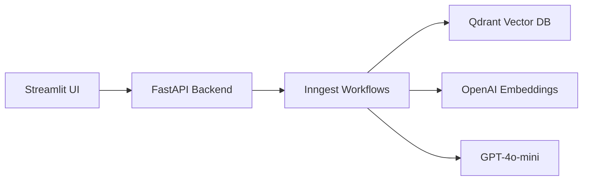

# Production-Grade RAG Python App

A production-ready Retrieval-Augmented Generation (RAG) application built with FastAPI, Qdrant, and OpenAI.

[](https://www.python.org/downloads/)
[](https://fastapi.tiangolo.com/)
[](https://opensource.org/licenses/MIT)

## Features

- **PDF Ingestion**: Upload and process PDF documents
- **Vector Search**: Semantic search powered by Qdrant
- **AI Responses**: Context-aware answers using GPT-4o-mini
- **Async Workflows**: Event-driven processing via Inngest
- **Production Ready**: Health checks, logging, error handling
- **Docker Support**: Full containerized deployment

## Architecture



## Quick Start

### Prerequisites

- Python 3.13+
- Docker Desktop
- OpenAI API key

### 1. Clone & Setup

```bash
git clone <repo-url>
cd Production-Grade-RAG-Python-App

# Copy environment file
copy .env.example .env
# Edit .env and add your OpenAI API key
```

### 2. Install Dependencies

Using uv (recommended):
```bash
uv sync
```

Using pip:
```bash
pip install -r requirements.txt
```

### 3. Start Services

**Option A: Docker Compose (Recommended)**
```bash
docker-compose up -d
```

**Option B: Manual Start (3 terminals)**

Terminal 1 - Qdrant:
```bash
docker run -p 6333:6333 qdrant/qdrant
```

Terminal 2 - Inngest:
```bash
npx inngest-cli@latest dev
```

Terminal 3 - FastAPI:
```bash
uv run uvicorn main:app --reload --port 8000
```

Terminal 4 - Streamlit:
```bash
uv run streamlit run streamlit_app.py
```

### 4. Access the App

| Service | URL |
|---------|-----|
| Streamlit UI | http://localhost:8501 |
| FastAPI Docs | http://localhost:8000/docs |
| Inngest Dashboard | http://localhost:8288 |
| Qdrant Dashboard | http://localhost:6333/dashboard |

## Configuration

All settings are configurable via environment variables:

| Variable | Default | Description |
|----------|---------|-------------|
| `OPENAI_API_KEY` | Required | Your OpenAI API key |
| `OPENAI_EMBED_MODEL` | `text-embedding-3-large` | Embedding model |
| `OPENAI_CHAT_MODEL` | `gpt-4o-mini` | Chat model |
| `QDRANT_URL` | `http://localhost:6333` | Qdrant server URL |
| `QDRANT_COLLECTION` | `docs` | Collection name |
| `CHUNK_SIZE` | `1000` | Text chunk size |
| `CHUNK_OVERLAP` | `200` | Chunk overlap |
| `APP_ENV` | `development` | Environment |
| `LOG_LEVEL` | `INFO` | Log level |

## API Endpoints

### Health Checks

```bash
# Full health check
curl http://localhost:8000/health

# Liveness probe (Kubernetes)
curl http://localhost:8000/health/live

# Readiness probe (Kubernetes)
curl http://localhost:8000/health/ready
```

### API Info

```bash
curl http://localhost:8000/
```

## Project Structure

```
Production-Grade-RAG-Python-App/
├── main.py              # FastAPI app + Inngest functions
├── streamlit_app.py     # Streamlit frontend
├── config.py            # Centralized configuration
├── data_loader.py       # PDF loading & embedding
├── vector_db.py         # Qdrant operations
├── custom_types.py      # Pydantic models
├── exceptions.py        # Custom exceptions
├── logging_config.py    # Logging setup
├── tests/               # Test suite
│   ├── conftest.py      # Pytest fixtures
│   ├── test_data_loader.py
│   ├── test_vector_db.py
│   └── test_api.py
├── Dockerfile           # FastAPI container
├── Dockerfile.streamlit # Streamlit container
├── docker-compose.yml   # Full stack
├── pyproject.toml       # Project config
├── requirements.txt     # Pip dependencies
└── .env.example         # Environment template
```

## Development

### Running Tests

```bash
# Install dev dependencies
uv sync --dev

# Run all tests
uv run pytest tests/ -v

# With coverage
uv run pytest tests/ -v --cov=. --cov-report=html
```

### Code Quality

```bash
# Type checking (if using pyright)
uv run pyright

# Formatting (if using ruff)
uv run ruff format .
uv run ruff check --fix .
```

## How It Works

1. **Upload PDF**: User uploads a PDF via Streamlit
2. **Chunk & Embed**: Text is chunked and embedded using OpenAI
3. **Store**: Vectors are stored in Qdrant
4. **Query**: User asks a question
5. **Search**: Relevant chunks are retrieved via semantic search
6. **Generate**: GPT-4o-mini generates an answer from context

## Contributing

1. Fork the repository
2. Create a feature branch: `git checkout -b feature/amazing-feature`
3. Commit changes: `git commit -m 'Add amazing feature'`
4. Push to branch: `git push origin feature/amazing-feature`
5. Open a Pull Request

## License

This project is licensed under the MIT License.
